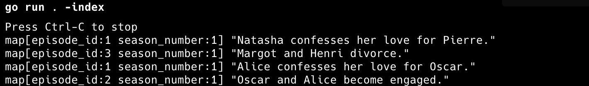

# Azure OpenAI pgvector Sample

## About
This sample shows how to use the [Azure OpenAI sample plugin](./azure/) for embedding creation and vector search using PostgreSQL and the [pgvector extension](https://github.com/pgvector/pgvector). It is based on the original [`pgvector` sample](https://github.com/firebase/genkit/tree/genkit%401.22.0/go/samples/pgvector) for Genkit Go that uses Google's `embedding-001` model. This sample uses Azure OpenAI's `text-embedding-3-small` instead.

Deploy `text-embedding-3-small` to your Azure OpenAI resource or Azure AI Foundry project before running the sample. The sample uses the Azure OpenAI `v1` API, so make sure to specify the correct base URL (i.e., ending with `/openai/v1`). 

## Running the Sample
Open two terminal windows or tabs in your preferred terminal application.

### Run App
In window/tab #1

```bash
cd aoai-pgvector

export AZ_OPENAI_BASE_URL=<your-azure-openai-endpoint>
export AZ_OPENAI_API_KEY=<your-azure-openai-api-key>
export GENKIT_ENV='dev'

docker compose up -d
# The index flag triggers the embedding generation
go run . -index
```

### Run Vector Search Flow 
In window/tab #2

```bash
genkit flow:run askQuestion '{"Show": "La Vie", "Question": "Who gets divorced?"}'
genkit flow:run askQuestion '{"Show": "Best Friends", "Question": "Who does Alice love?"}' 
```

The vector search result is written as log output to stderr (i.e., in terminal/tab #1).

