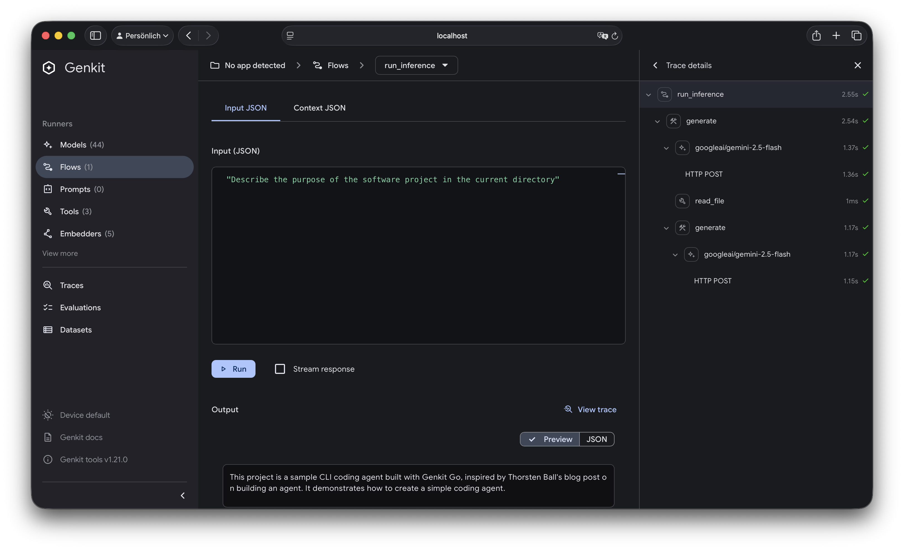

# Code Agent Sample

## About
This sample demonstrates building a simple CLI coding agent with Genkit Go. 

This sample is inspired by Thorsten Ball's awesome code agent sample he has blogged about [here](https://ampcode.com/how-to-build-an-agent).   

## Running the Sample
```bash
cd code-agent
export GEMINI_API_KEY=<your-api-key>
go run .
```

## Using Genkit Go's Dev Tools
The agent's core logic is defined as a [Genkit Flow](https://genkit.dev/docs/flows/?lang=go). This allows you to debug the flow and the tools used by the agent in Genkit's Developer UI. 

```bash
cd code-agent
export GEMINI_API_KEY=<your-api-key>
genkit start -- go run .
```
