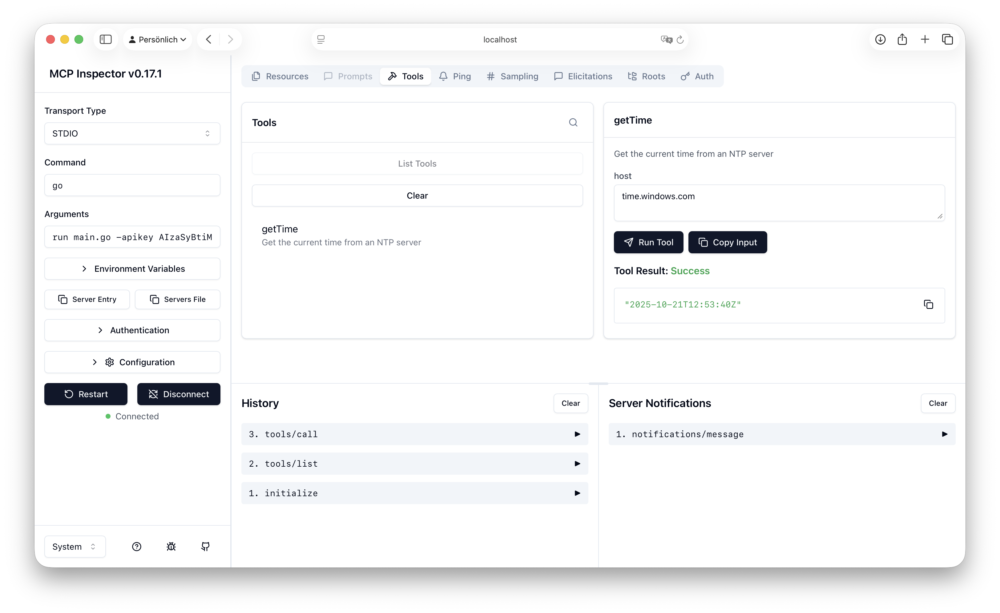
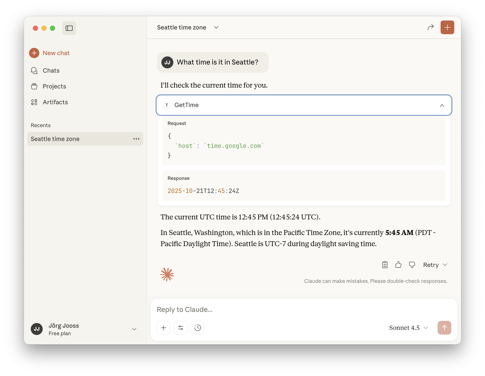

# MCP Server Sample

## About 
This sample demonstrates building a very simple MCP server using Genkit Go. The MPC server obtains the current time from an NTP host provided by the caller.

## Testing the Sample with MCP Inspector

```bash
cd /path/to/genkit-go-samples/mcp-server/

# Using Node.js
npx @modelcontextprotocol/inspector go run main.go

# Using Bun
bunx @modelcontextprotocol/inspector go run main.go
```



> See the [MCP Inspector documentation](https://modelcontextprotocol.io/docs/tools/inspector) for more details on how to use the tool.

## Using the Sample with Claude Desktop

Add the following MCP server definition to Claude Desktop's configuration file. Depending on where you have Go installed, whether you have added the Go tool to the system PATH, and where the source code for this sample is stored, you may need to update the `command` or the `args` shown below.

```json
  "mcpServers": {
    "time": {
      "command": "/usr/local/go/bin/go",
      "args": [
        "run",
        "-C",
        "/path/to/genkit-go-samples/mcp-server/",
        "main.go"
      ]
    }
  }
```

> See the [Claude Desktop documentation](https://modelcontextprotocol.io/docs/develop/connect-local-servers) for more details on how to configure your own MCP servers.

After you have updated the configuration file, restart Claude Desktop and ask for the current time in a city of your choice.



Note that Claude Desktop is smart enough to pick a suitable NTP host such as `time.google.com` or `time.windows.com`—there is no default host provided in our sample MCP server code!